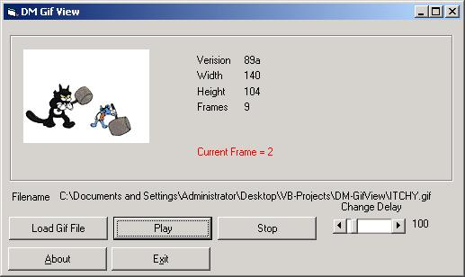

## DM Gif View

### Description

Hello eveyone this my attempt at playing Animated Gifs in vb this is quit a cheap way of doing it but it does seems to work quite well it uses no API, ActiveX, The Internet Browser control just pure vb code and some image arrays and a timer. anyway Have a look and see what you think please vote if you like this code. I am also at the moment working on a AVI player as well. Please leve lots of comments
 
### More Info
 

             |
---                |---
**Submitted On**   |2001-06-09 11:17:30
**By**             |[dreamvb](https://github.com/Planet-Source-Code/PSCIndex/blob/master/ByAuthor/dreamvb.md)
**Level**          |Beginner
**User Rating**    |5.0 (75 globes from 15 users)
**Compatibility**  |VB 5\.0, VB 6\.0
**Category**       |[Graphics](https://github.com/Planet-Source-Code/PSCIndex/blob/master/ByCategory/graphics__1-46.md)
**World**          |[Visual Basic](https://github.com/Planet-Source-Code/PSCIndex/blob/master/ByWorld/visual-basic.md)
**Archive File**   |[DM Gif Vie22295762001\.zip](https://github.com/Planet-Source-Code/dreamvb-dm-gif-view__1-24767/archive/master.zip)

